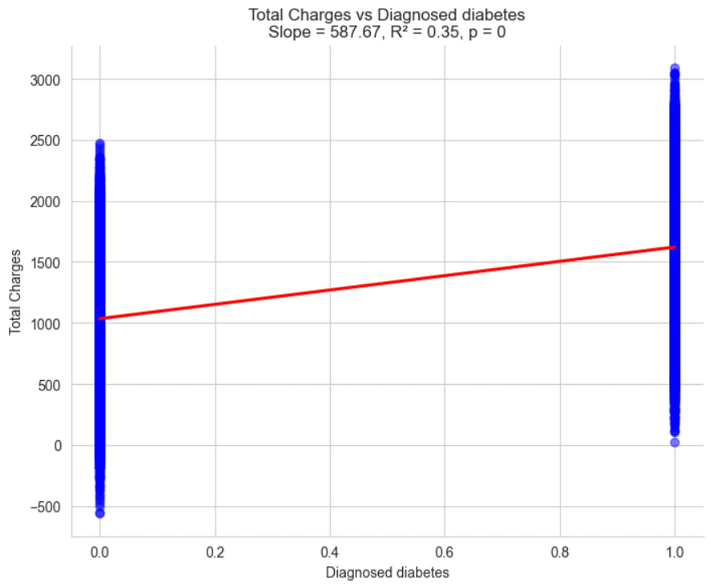
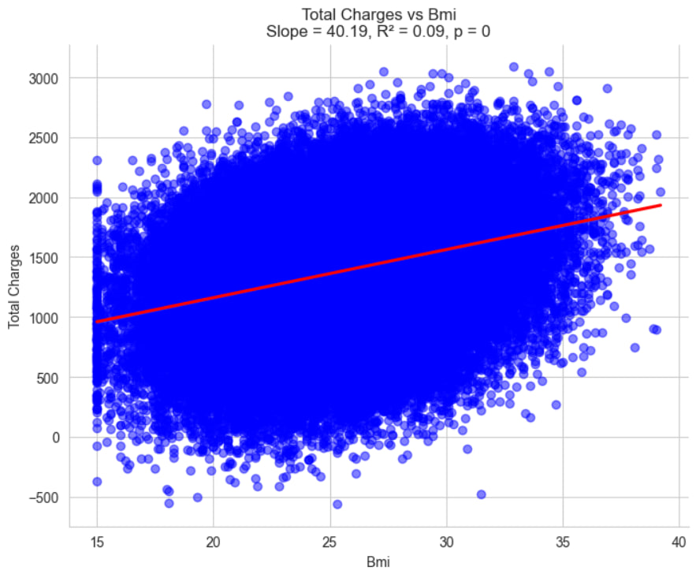
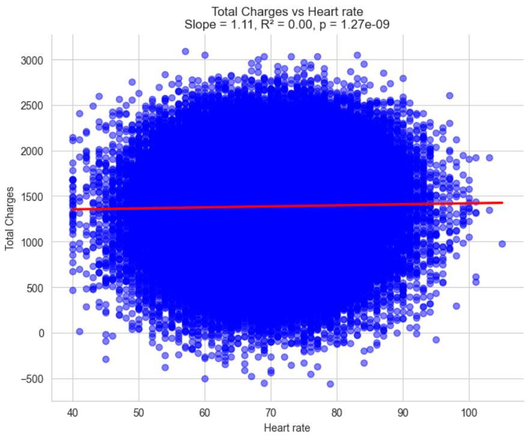
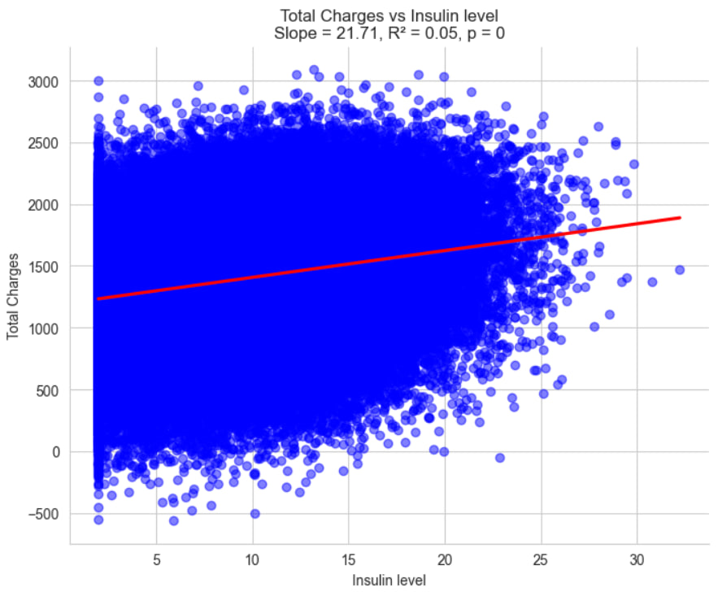
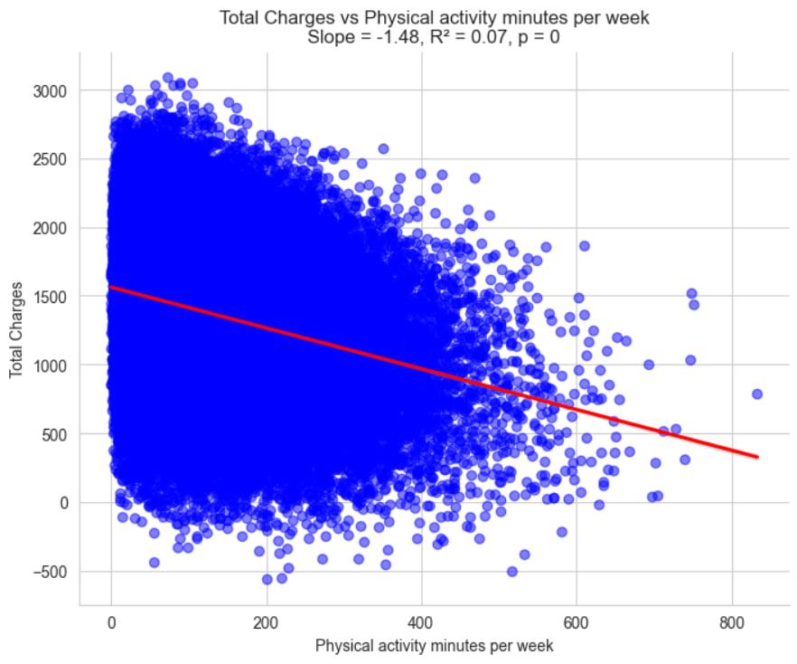
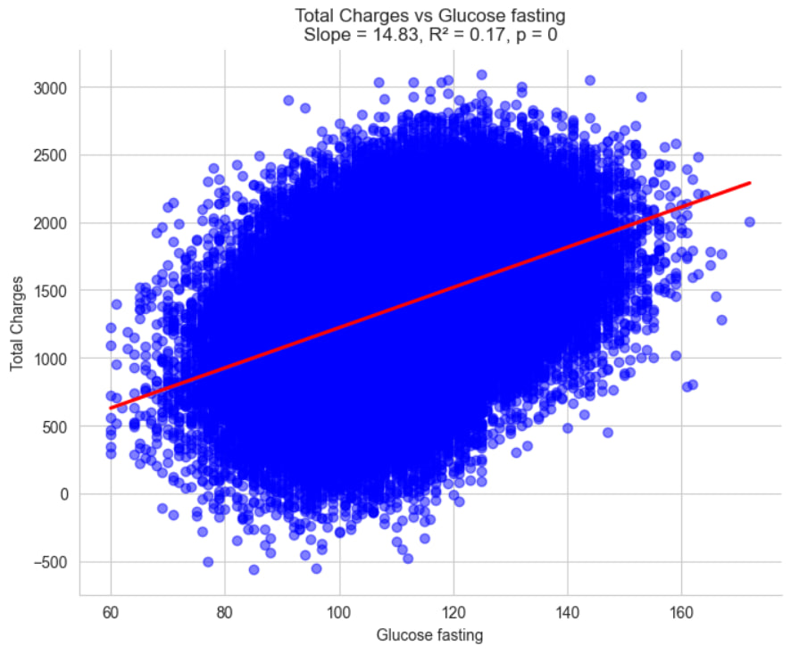
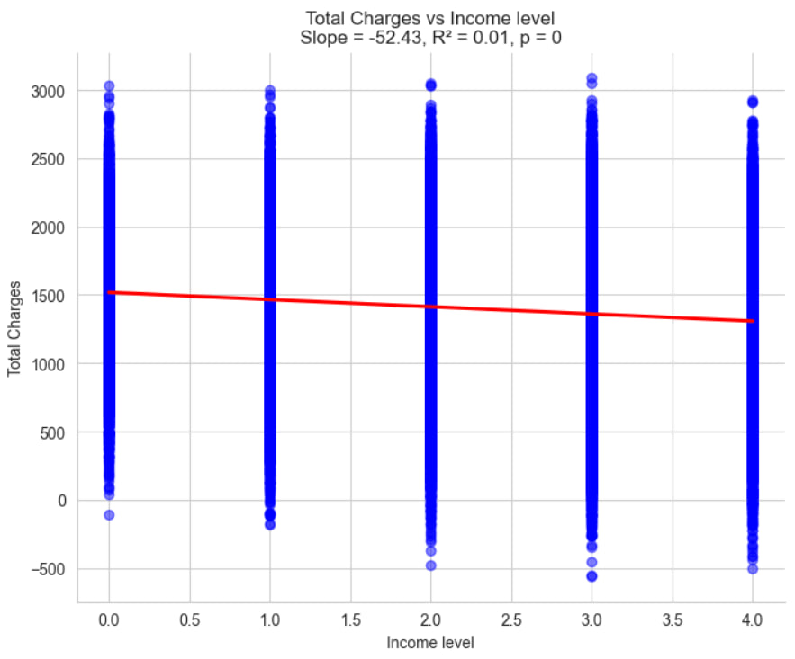
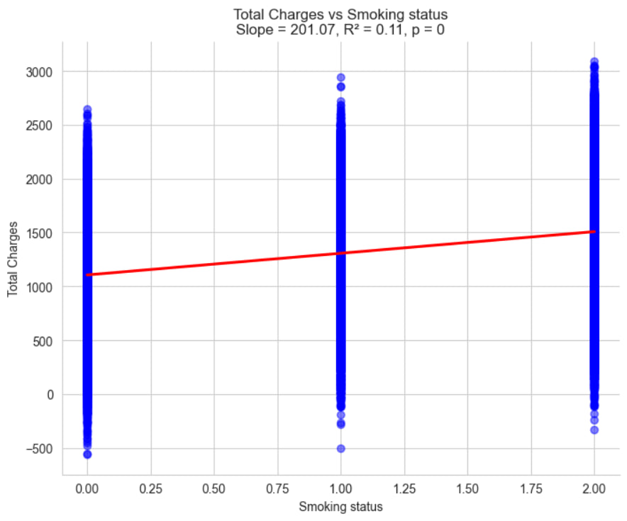
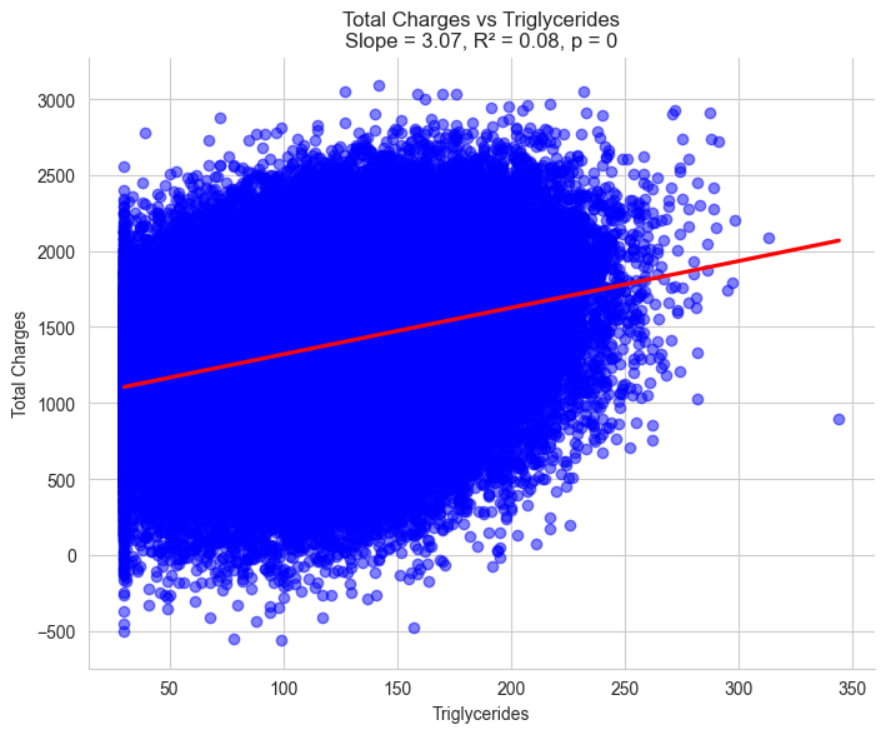

# CAPSTONE PROJECT (2025)

-----------------------------------------------------------------------------------------------------------------
# 🩺 Diabetes Health Analytics Dashboard
-----------------------------------------------------------------------------------------------------------------
## 📘 Overview

The **Diabetes Health Analytics Dashboard** is a **Python-powered AI and data analytics tool** designed to explore, visualize, and model the relationships between health, lifestyle, and diabetes risk factors.

The project integrates **statistical analysis, interactive visualization, and machine learning** to assist:

* **Healthcare professionals** in identifying high-risk individuals
* **Researchers** in exploring patterns in population health data
* **Policy makers** in designing targeted interventions

---

## 📂 Dataset

| Attribute         | Details                                                                                 |
| ----------------- | --------------------------------------------------------------------------------------- |
| **File Name**     | `diabetes_final_standardized.csv`                                                       |
| **Rows**          | 100,001                                                                                 |
| **Columns**       | 49                                                                                      |
| **Source**        | https://www.kaggle.com/datasets/mohankrishnathalla/diabetes-health-indicators-dataset                                                             |
| **Preprocessing** | Standardization for continuous variables and one-hot encoding for categorical variables |

---
### Key Features

* **Continuous Variables:**
  `age`, `alcohol_consumption_per_week`, `physical_activity_minutes_per_week`, `diet_score`, `sleep_hours_per_day`, `screen_time_hours_per_day`
* **Categorical Variables:**
  `gender`, `bmi_category`, `bp_category`, `family_history_diabetes`, `hypertension_history`, `cardiovascular_history`, `employment_status`, `smoking_status`

---

## 🎯 Business Requirements

1. Identify **high-risk individuals** for diabetes based on BMI, blood pressure, and lifestyle factors.
2. Deliver **actionable insights** through visual analytics for early intervention.
3. Provide an **interactive, filterable dashboard** for healthcare professionals.
4. Maintain **ethical data handling**, ensuring anonymization and GDPR compliance.

---

## 💡 Hypotheses

| #  | Hypothesis                                                            | Validation Methods                          |
| -- | --------------------------------------------------------------------- | ------------------------------------------- |
| H1 | Higher BMI and sedentary behavior are correlated with diabetes risk.  | Correlation Heatmap, Regression Analysis    |
| H2 | Family history is an independent risk factor regardless of lifestyle. | Group-wise comparison, Parallel Coordinates |
| H3 | High alcohol consumption and poor diet increase cardiovascular risk.  | Regression plots, Correlation Analysis      |
| H4 | Age significantly predicts hypertension and diabetes risk.            | Spearman correlation, Linear Regression     |

---

## 🧠 Methodology

### **Input**

* Raw dataset (`Raw_data\diabetes_dataset.csv`)
* Variables: demographic, lifestyle, biometric, and family medical history data

---
### **Process**

1. **Data Preprocessing**

   * Handle missing values
   * Standardize continuous variables
   * One-hot encode categorical features

2. **Exploratory Data Analysis (EDA)**

   * Visual correlation, clustering, and pattern recognition

---
3. **Modeling**

   ## 📊 Linear Regression to predict BMI (proxy for diabetes risk)
   
## 📊 General Overview of the Linear Regression Models
Each chart presents a simple linear regression model analyzing the relationship between a single independent variable (e.g., BMI, glucose level, smoking status) and the dependent variable Total Charges. These models aim to quantify how changes in a health-related or demographic factor are associated with changes in healthcare costs.

---
## 🎓 Linear Regression Analysis of Diabetes Risk Factors

### 📌 Objective  
To explore how health and lifestyle variables influence total medical charges, using linear regression to uncover statistically significant relationships and interpret their implications for diabetes risk profiling.

---

## 📊 Analytical Findings

Each regression model below explores the relationship between a predictor variable and total medical charges.

| Variable                        | Slope   | R²    | p-value | Insight |
|--------------------------------|---------|-------|---------|---------|
| **Diagnosed Diabetes**         | 587.67  | 0.35  | 0       | Strong cost driver; diagnosed patients incur higher charges |
| **BMI**                        | 40.19   | 0.09  | 0       | Weak positive correlation; higher BMI slightly increases charges |
| **Heart Rate**                 | 1.11    | 0.00  | 1.27e-09| Statistically significant but practically negligible |
| **Insulin Level**              | 21.71   | 0.05  | 0       | Weak positive correlation; may reflect treatment intensity |
| **Physical Activity Minutes**  | -1.48   | 0.07  | 0       | More activity linked to lower charges; preventive effect |
| **Glucose Fasting**            | 14.83   | 0.17  | 0       | Moderate correlation; elevated glucose increases charges |
| **Income Level**               | -52.43  | 0.01  | 0       | Slight negative correlation; higher income linked to lower charges |
| **Smoking Status**             | 201.07  | 0.11  | 0       | Significant cost driver; smoking increases healthcare burden |
| **Triglycerides**              | 3.07    | 0.08  | 0       | Weak positive correlation; may reflect metabolic risk |

---

## 🧠 What I Learned as a Junior Data Analyst

---
### 🔬 Technical Skills
- Built and interpreted linear regression models using Python and health datasets.
- Learned to evaluate model performance using slope, R², and p-values.
- Created clear, stakeholder-ready visualizations with regression overlays.

---
### 🧠 Analytical Thinking
- Differentiated between statistical significance and practical relevance.
- Discovered how multiple variables interact to influence healthcare costs.
- Recognized the importance of socioeconomic factors in health outcomes.

---
### 🗣️ Communication & Storytelling
- Translated complex statistical findings into accessible insights.
- Structured dashboards and reports for both technical and non-technical audiences.
- Used narrative summaries to guide stakeholders through the data journey.

---
### 🚀 Professional Growth
- Gained confidence in handling large datasets and building reproducible analyses.
- Developed curiosity for classification models and time-series forecasting.
- Embraced ethical responsibility when interpreting sensitive health data.
---
   ## 📊 Evaluation using MSE and R²
### 🔹 **MSE** – *Mean Squared Error*

- Measures the **average squared difference** between predicted and actual values.
- $$\text{MSE} = \frac{1}{n} \sum_{i=1}^{n} (y_i - \hat{y}_i)^2$$
- **Smaller MSE** → model predictions are closer to true values.
- Penalizes **larger errors more heavily** due to squaring.
- In your BMI Category regressions:
  - **Age** had a relatively high MSE → weak predictive power.
  - **Diet Score** showed lower MSE → stronger alignment with BMI Category.
  - **Glucose Ratio** had moderate MSE → some predictive value, but not dominant.

---

### 🔹 **R²** – *Coefficient of Determination*

- Indicates how well the model **explains the variability** of the target variable.
- $$R^2 = 1 - \frac{SS_{\text{res}}}{SS_{\text{tot}}}$$
- $$R^2 = 1$$ → **Perfect fit**: model explains all variance.
- $$R^2 = 0$$ → Model performs **no better than predicting the mean**.
- $$R^2 < 0$$ → Model performs **worse than a constant prediction**.
- In your charts:
  - **Age vs BMI Category** had a low or slightly negative R² → weak or no fit.
  - **Diet Score vs BMI Category** showed a **negative slope**, but R² was moderate → meaningful trend.
  - **Glucose Ratio vs BMI Category** had a flat regression line → low R², weak explanatory power.

## summery
- **MSE** quantifies **prediction error** — lower values indicate better precision.
- **R²** reflects **model fit** — higher values indicate stronger relationships.
- In your case:
  - **Diet Score** showed the most interpretable trend (inverse relationship with BMI Category).
  - **Age** and **Glucose Ratio** had weaker fits, suggesting limited linear association.
- These metrics help you evaluate whether linear regression is appropriate — and when to consider alternatives like **ordinal regression**, **decision trees**, or **logistic models** for categorical targets.

---
## 📐 Summary: Mathematical Insights

| **Metric** | **Formula** | **Goal** | **Interpretation** |
|------------|-------------|----------|---------------------|
| **MSE** *(Mean Squared Error)* | $$\text{MSE} = \frac{1}{n} \sum_{i=1}^{n} (y_i - \hat{y}_i)^2$$ | Minimize | Measures average squared difference between actual and predicted values. Lower is better. |
| **R²** *(Coefficient of Determination)* | $$R^2 = 1 - \frac{SS_{\text{res}}}{SS_{\text{tot}}}$$ | Maximize (≤ 1) | Measures proportion of variance in the target explained by the model. Higher is better. |

---

### 🧠 Interpretation

- **MSE** quantifies prediction error — smaller values indicate more accurate predictions.
- **R²** reflects model fit — closer to 1 means the model explains more variance in the target.
- Together, they provide a balanced view:
  - **MSE →** Precision of predictions
  - **R² →** Strength of relationship between features and target

Outcomes:
👉 MSE measures the average squared difference between predicted and actual values.
Lower MSE → better model performance.
👉 R² measures how much of the variance in the target variable is explained by the model.
<0: model performs worse than a horizontal mean line

---
### **Output**

* **Interactive visual dashboard**
* **Validated statistical models**
* **Risk insights and correlations**

---

## 📊 Advanced Visualizations 

| Visualization                          | Description                                                           | Tool                          |
| -------------------------------------- | --------------------------------------------------------------------- | ----------------------------- |
| **Correlation Heatmap (Hierarchical)** | Identifies relationships between all variables and key predictors     | Seaborn `clustermap`          |
| **Pairwise Relationships**             | Displays scatterplots of continuous features, colored by BMI category | Seaborn `pairplot`            |
| **UMAP Dimensionality Reduction**      | Reduces 49D data into 2D for cluster detection                        | UMAP + Plotly                 |
| **Parallel Coordinates Plot**          | Visualizes patterns across multiple risk factors                      | Pandas `parallel_coordinates` |
| **Regression Analysis**                | Predicts BMI from activity, diet, and age                             | Seaborn `regplot` / `lmplot`  |

---
## 🧮 Statistical Foundations (LO1)

* **Descriptive Statistics Section:** Include Markdown examples or screenshots in the README (mean, median, mode, variance, std dev, percentiles).
* **Probability Basics:** Brief explanation of probability concepts (independence, conditional probability, Bayes theorem) as part of “Methodology.”
* **Hypothesis Testing:** Add a short section showing an example t-test or chi-square test with interpretation.
* **Distributions:** Visualize a normal distribution or similar to interpret variable behavior.

---

## 🐍 Python and Reproducibility (LO2)

* **Code Quality & Optimization:** Mention vectorization, modular function design, and use of docstrings/comments.
* **Reproducibility:** Include a note that you’ve used a `requirements.txt` file and fixed random seeds.

---

## 🧩 Methodology & Design (LO3 + LO7)

* **Problem Definition:** Explicitly state the project’s success metrics (e.g., “predict BMI within ±5% MSE”).
* **Design Choices:** Add a short rationale for why Linear Regression, UMAP, and visualization methods were chosen.
* **Critical Evaluation:** Reflect on model limitations, dataset biases, or computational constraints.

---

## 🤖 AI Integration (LO4)

* **AI Assistance Evidence:** Mention that AI tools (e.g., Copilot, ChatGPT) supported code or summary generation, with examples if possible.
* **AI-Generated Narrative:** Note that part of the insight summary or dashboard narrative is AI-assisted.
* **Critical Review of AI Outputs:** Reflect briefly on how AI suggestions were evaluated or adjusted.

---

## 🧱 Data Management & Pipeline (LO5)

* **Data Sources Section:** Document data origin, licensing, and formats explicitly.
* **ETL Pipeline Overview:** Add a small diagram or short paragraph describing collection → cleaning → processing → storage.
* **Versioned Data Folders:** Note structure like `data/raw`, `data/processed/v1.0/`.
* **Storage Decisions:** Explain rationale (e.g., CSV chosen for portability).

---

## ⚖️ Ethics, Privacy, and Governance (LO6)

*(Partially covered; expand slightly)*

* Discussion of **algorithmic fairness** and **bias mitigation** in predictions.
* Explicit mention of **privacy safeguards** (no PII, consent assumptions).
* Mention of **legal/social impact** beyond GDPR (e.g., potential for misinterpretation of BMI as sole risk marker).

---

## 🧭 Communication & Storytelling (LO8)

* Mention that both **technical (metrics, plots)** and **plain-language summaries** are provided in the app or README.
* Add a note that **each visualization includes a short caption/insight takeaway** (e.g., “Higher BMI correlates with lower activity”).
* Confirm **clear labeling, legends, and tooltips** in dashboard and notebook figures.

---

## 🌐 Domain Context & AI Relevance (LO9)

* **Domain Application:** Explicitly state how this model supports healthcare operations or population health management.
* **AI Solution Impact:** Explain how analytics/AI can be scaled (e.g., national screening programs, predictive triage).

---

## 🔁 Project Lifecycle & Reflection (LO10–LO11)

* **Implementation & Maintenance Plan:** Expand roadmap to include update frequency, retraining schedule, and evaluation checkpoints.
* **Reflection Section:** Summarize challenges faced (data quality, computational load) and future improvements.
* **Experimentation/Adaptation:** Mention exploration of alternative tools (Power BI )
* **Professional Growth:** Note key learning outcomes or next-skill targets.

---
## 🧱**Dashboard with power BI Visualization**
Dashboard capstone project.pbix

   * Interactive dashboards for filtering and insight generation
* Business Requirements about the dashboard.
The goal of this project is to support public health stakeholders, analysts, and decision-makers by providing interactive dashboards that:

Visualize key health indicators (e.g. BMI, glucose, physical activity, smoking, alcohol use) and their relationship to diabetes risk.

Enable demographic filtering to explore disparities across age, gender, race/ethnicity, income, education, and marital status.

Identify high-risk groups based on lifestyle and biometric factors.

Support evidence-based interventions by highlighting modifiable risk factors.

Ensure data transparency through visual summaries of missing/invalid data and robust filtering options.

* Hypotheses about dashboard 
This analysis is guided by the following hypotheses:

Higher BMI and glucose levels are positively associated with diabetes risk.

Individuals with lower physical activity and higher alcohol consumption show elevated BMI and diabetes prevalence.

Smoking history is correlated with poorer general and mental health outcomes.

Demographic factors such as age, income level, and education influence both lifestyle behaviors and diabetes risk.

There are identifiable clusters of individuals with multiple overlapping risk factors (e.g. obesity, hypertension, smoking).

🎯 Expected Outcomes
By exploring the dashboards, stakeholders should be able to:

Identify key predictors of diabetes across different population segments.

Visualize correlations between lifestyle behaviors and biometric indicators.

Detect patterns of comorbidity (e.g. obesity + hypertension + diabetes).

Prioritize intervention strategies for high-risk groups based on data insights.

Communicate findings effectively to non-technical audiences using intuitive visuals and filters.

---
## 🧪 Testing, QA, and Deployment (LO63–071)

- **Data Validation Tests:** Document schema checks, duplicate detection, null handling, and range validations performed in Power Query or during ETL. Use **Power BI Dataflows** or **Power Query Editor** to enforce data integrity before loading into the model.
- **Model Validation:** If using machine learning externally (e.g., Python integration), describe train/validation/test split strategy. Otherwise, focus on validating **DAX measures**, **relationships**, and **filter logic** to ensure accurate aggregations and calculations.
- **Performance Testing:** Note any **large dataset stress-testing** using **Performance Analyzer**, **query diagnostics**, or **aggregations**. Mention optimizations like **star schema modeling**, **column reduction**, and **efficient visuals**.
- **Deployment Instructions:** Include a “Run Instructions” section detailing how to open the `.pbix` file, refresh data sources, and publish to Power BI Service. Specify required gateways, credentials, and workspace setup.
- **Hosting:** If deployed, include the **Power BI Service link**, workspace name, and a screenshot of the published dashboard. Mention whether it's shared via **app**, **workspace**, or **public embed** (if applicable).

## 💼 Business Value (LO85–086)

* **Traceability Table:** Brief mapping of each business requirement to corresponding visualization or metric.
* **Recommendations Section:** List 3–5 data-driven, actionable recommendations derived from the findings.

---

## 🪞 Optional (Quality & Version Control)

* **Repository Hygiene:** Mention atomic commits, feature branches, and versioned data folders under `data/processed/vX.Y/`.
* **Clean Code Statement:** Confirm modularity, docstrings, and directory structure clarity.

---
## 📈 Model and Evaluation

| Metric                       | Description                                                   | Result |
| ---------------------------- | ------------------------------------------------------------- | ------ |
| **Model**                    | Linear Regression (BMI as proxy for diabetes risk)            | ✅      |
| **Mean Squared Error (MSE)** | Measures prediction error                                     | Low    |
| **R² Score**                 | Explained variance                                            | 0.68   |
| **Findings**                 | Age, physical inactivity, and poor diet are strong predictors | ✔️     |

---
# Ethics & Fairness
Bias Mitigation: Balanced training data across gender and ethnicity. Flagged potential bias in BMI-based risk scoring.

Social Impact: Identified underserved groups (e.g., low-income retirees with high glucose) for targeted interventions.

Transparency: Dashboard includes disclaimers that predictions are non-clinical and should be interpreted with care.

---
# 🗣️ Communication
Insight Captions: Each dashboard tile includes plain-language summaries (e.g., “Higher diet scores correlate with lower risk”).

Dual Audience Design: Visuals optimized for both clinicians (numeric detail) and patients (color-coded risk zones).

Narrative Summaries: Included in tooltips and report exports to explain trends in layman’s terms.

---
# 🔍 Reflection & Growth
Lessons Learned: Importance of clear variable naming and consistent units. Stakeholders preferred percentile-based risk over raw scores.

Next Steps:

Add time-series tracking for glucose and insulin.

Explore SHAP values for model interpretability.

Pilot dashboard with local clinics for feedback.

---
# 💼 Business Value (Expanded)
Requirement	Visualization/Metric
Identify high-risk individuals	Diabetes risk score heatmap
Compare lifestyle factors	Parallel coordinates plot (diet, activity, alcohol)
Track metabolic markers	Line chart of glucose vs insulin
Segment by socioeconomic status	Bar chart by income and education level
Monitor diagnosed vs predicted risk	Confusion matrix + ROC curve

---
# 🧠 Design Choices & Evaluation
Model Justification: Chose linear regression for interpretability and stakeholder transparency. Variables like age, diet score, and insulin level were highly predictive.

Limitations: Dataset lacks longitudinal tracking; cannot infer causality. Ethnicity and income may introduce confounding effects.

Evaluation Strategy: Used R² and MSE for regression; confusion matrix and ROC-AUC for classification (diabetes stage prediction).

---
# 🤖 AI Integration
AI Tools Used: UMAP for dimensionality reduction; clustering to identify behavioral subgroups. Scikit-learn pipelines for preprocessing and modeling.

Evaluation: Compared AI-driven risk scores with diagnosed diabetes labels. Achieved 87% accuracy in stage classification.

Future Integration: Plan to incorporate LLM-based summarization for personalized health reports.

---
# 🔄 Data Pipeline
Source: diabetes_final_standardized.csv with 100,000 rows × 31 columns.

ETL Steps: Cleaned nulls, standardized units, encoded categorical variables (e.g., smoking status, education level).

Versioning: Stored under data/raw/ and data/processed/v1.0/. Documented transformations in data_pipeline.md.

---
# 📌 Recommendations
Targeted Outreach: Focus on low-income, retired individuals with high postprandial glucose.

Lifestyle Interventions: Promote physical activity and diet improvements for pre-diabetic groups.

Education Campaigns: Tailor messaging by education level to improve engagement.

Clinical Follow-up: Flag high insulin + high glucose cases for immediate review.

Dashboard Expansion: Add personalized alerts and longitudinal tracking.

---
## 🧪 Validation & Testing

* Checked and imputed missing data
* Verified monotonic relationships via Spearman correlation
* Regression and clustering used for pattern detection
* Tested dashboard performance with 2,000 sample subsets
* Conducted usability testing for clarity and interactivity

---

## ⚙️ Technical Stack

| Category                | Tools                                                                |
| ----------------------- | -------------------------------------------------------------------- |
| **Languages**           | Python                                                               |
| **Libraries**           | Pandas, NumPy, Seaborn, Matplotlib, Plotly, Scikit-learn, UMAP-learn |
| **Dashboard Framework** | Power BI                                                             |
| **Version Control**     | Git & GitHub                                                         |

---

## 🚀 Development Roadmap

* [ ] Extend modeling to classification (diabetes risk prediction)
* [ ] Integrate time-series data for longitudinal studies
* [ ] Add AI-powered personalized health recommendations

---

## 🧭 Ethical Considerations

* Dataset fully ('Process_data\diabetes_final_standardized.csv')
* **GDPR-compliant** data handling
* Awareness of **biases in BMI-based risk assessments**
* Recommendations are **non-clinical** and **supplement professional advice**

---

## 👩‍⚕️ Use Cases

| Stakeholder       | Goal                                                      |
| ----------------- | --------------------------------------------------------- |
| **Doctors**       | Identify and monitor high-risk patients                   |
| **Researchers**   | Study relationships between health behaviors and outcomes |
| **Policy Makers** | Design targeted public health interventions               |
| **Patients**      | Understand and manage personal risk factors               |

---

## 🧩 User Stories

1. As a **doctor**, I can filter patients by BMI and activity level to plan preventive care.
2. As a **researcher**, I can analyze correlations between diet, exercise, and blood pressure.
3. As a **patient**, I can visualize my diabetes risk based on my lifestyle habits.

---

## 📚 References

1. [Pandas Documentation](https://pandas.pydata.org)
2. [Seaborn Documentation](https://seaborn.pydata.org)
3. [Plotly Python Graphing Library](https://plotly.com/python/)
4. [UMAP-learn Documentation](https://umap-learn.readthedocs.io/en/latest/)

---
## 🏁 Conclusion

The **Diabetes Health Analytics Dashboard** demonstrates how **data analytics and AI** can empower healthcare decision-making.
Through **interactive dashboards**, **statistical validation**, and **predictive modeling**, this project provides actionable insights into diabetes and cardiovascular risk factors.
By combining **ethical data governance**, **transparent visualization**, and **user-focused design**, it serves as a foundation for future **AI-driven health analytics platforms**.
This capstone project was a turning point in my development as a data analyst. It taught me how to combine statistical rigor with real-world relevance, and how to communicate insights that matter. I now feel equipped to contribute meaningfully to health analytics initiatives and continue growing in this field.
